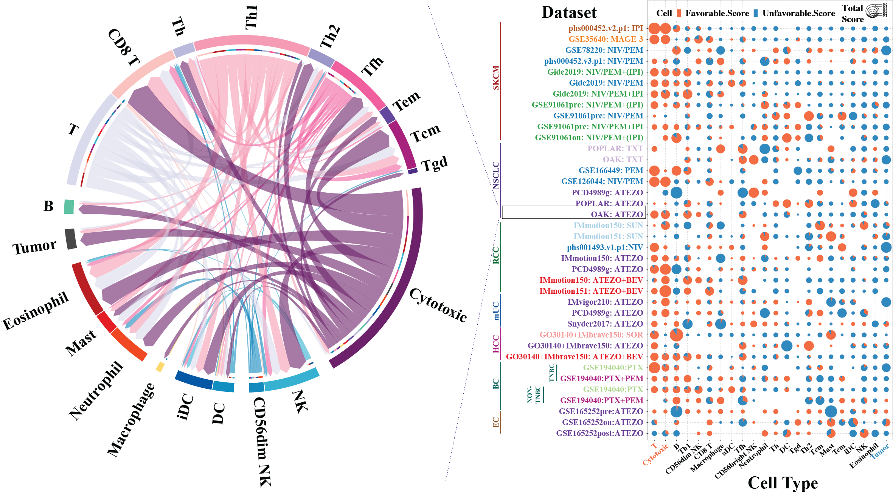
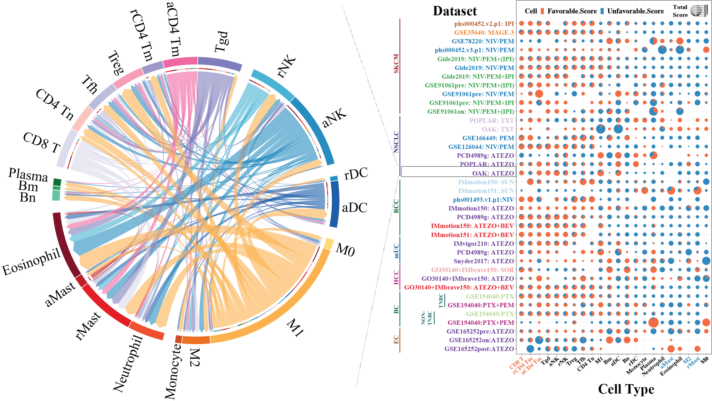
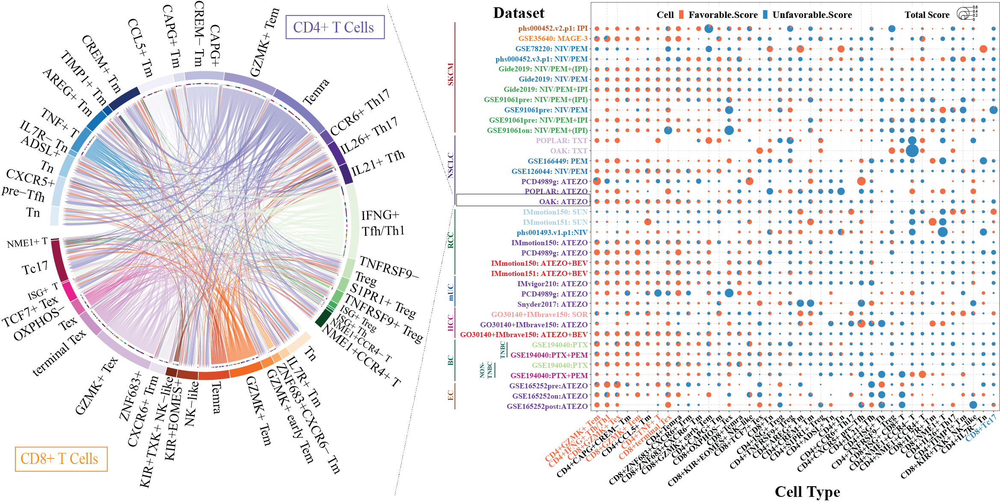

# MSofTimiGP-Response
This repo includes all codes and intermediate for the manuscript of the TimiGP-Response. Of note, it includes the cell-cell interaction network of each dataset for the pan-cancer immune landscape associated with immunotherapy response.

## Table of Contents
- [TimiGP-Response](#timigp-response)
- [Overview of the Repository](#overview-of-the-repository)
- [Dataset Description](#dataset-description)
- [Pan-Cancer Immune Landscape](#pan-cancer-immune-landscape)
- [Citation](#citation)
- [LICENSE](#license)

## TimiGP-Response
TimiGP-Response is an analysis module under the [TimiGP computaional framework](https://github.com/CSkylarL/TimiGP). It is designed to infer cell-cell interactions in tumor immune microenvironment (TIME) through gene pairs, and evaluate the cell types assocaited with immunotherapy response.

# TODO
For more details, please read our manuscript: [TimiGP: ](https://doi.org/10.1016/j.xcrm.2023.101121).

## Overview of the Repository
This repository contains the codes and intermediate data for the manuscript of the TimiGP-Response. The repository is organized as follows:
1. `Fig1` folder: The codes and intermediate data for Fig1.
    1) `code` folder: config files and R codes to generate the corresponding figures.
        - [Fig1_config.R](./Fig1/code/Fig1_config.R) file: config file for the R codes.
        - [Fig1_function.R](./Fig1/code/Fig1_function.R) file: function file for the R codes.
        - `Fig1.*.R` files: R codes to generate the corresponding figures. Please run following the order of the file name (from script 1 to 5).
        - [sessionInfo.txt](./Fig1/code/sessionInfo.txt) file: the session information of the R environment.

    2) `result` folder: intermediate results and original figures.
        - [TNBC_scRNA_GSE169246](./Fig1/result/TNBC_scRNA_GSE169246/) folder: results generated from [Fig1.script1_Preprocess_scRNAseq.R](./Fig1/code/Fig1.script1_Preprocess_scRNAseq.R)
        - [customized_markers_for_TimiGP](./Fig1/result/customized_markers_for_TimiGP/) folder: results generated from [Fig1.script2_generate_TimiGP_markers.R](./Fig1/code/Fig1.script2_generate_TimiGP_markers.R)
        - [TimiGP_TNBC_scRNA_marker_for_spatial](./Fig1/result/TimiGP_TNBC_scRNA_marker_for_spatial/) folder: results generated from [Fig1.script3_customized_TimiGP_response_for_TNBC.R](./Fig1/code/Fig1.script3_customized_TimiGP_response_for_TNBC.R)
        - [TNBC_spatial_ratio_responder](./Fig1/result/TNBC_spatial_ratio_responder/) folder: results generated from [Fig1.script4_reanalyze_spatial_IMC.R](./Fig1/code/Fig1.script4_reanalyze_spatial_IMC.R)
        - [Figures_Tables](./Fig1/result/Figures_Tables/) folder: results generated from [Fig1.script5_generate_Figures_Tables.R](./Fig1/code/Fig1.script5_generate_Figures_Tables.R)                         

2. `Fig2` folder: The codes and intermediate data for Fig2.
    1) `code` folder: config files and R codes to generate the corresponding figures.
        - [config.rda](./Fig2/code/config.rda) file: config file for the R codes.
        - `Fig2.*.R` files: R codes to generate the corresponding figures. Please run following the order of the file name (from script 1 to 5).
        - [sessionInfo.txt](./Fig2/code/sessionInfo.txt) file: the session information of the R environment.
    2) `result` folder: intermediate results and original figures.
        - [pan_cancer_Tumor_TIME_control](./Fig2/result/pan_cancer_Tumor_TIME_control/) folder: results generated from [Fig2.script1_pan_cancer_Tumor_TIME_control.R](./Fig2/code/Fig2.script1_pan_cancer_Tumor_TIME_control.R)
        - [pan_cancer_TIME_landscape](./Fig2/result/pan_cancer_TIME_landscape/) folder: results generated from [Fig2.script2_pan_cancer_TIME_landscape.R](./Fig2/code/Fig2.script2_pan_cancer_TIME_landscape.R)
        - [pan_cancer_T_Cell_landscape](./Fig2/result/pan_cancer_T_Cell_landscape/) folder: results generated from [Fig2.script3_pan_cancer_T_Cell_landscape.R](./Fig2/code/Fig2.script3_pan_cancer_T_Cell_landscape.R)
        - [summary](./Fig2/result/summary/) folder: results generated from [Fig2.script4_summary_favorability_score.R](./Fig2/code/Fig2.script4_summary_favorability_score.R) and [Fig2.script5_summary_TIME_similarity.R](./Fig2/code/Fig2.script5_summary_TIME_similarity.R)

## Dataset Description
The datasets used in this study are publicly available. The preprocessed datasets for this study are stored through zenodo. Please request and download the datasets and move the `data` folder to the root directory of the repository. 
# TODO
zenodo link

The `data` folder contains the following subfolders:
1. `TNBC_scRNA_GSE169246` folder: preprocessed scRNA-seq data for TNBC patients, which is downloaded from [GSE169246](https://www.ncbi.nlm.nih.gov/geo/query/acc.cgi?acc=GSE169246) and preprocessed with [Fig1.script1_Preprocess_scRNAseq.R](./Fig1/code/Fig1.script1_Preprocess_scRNAseq.R).
2. `bulk_transcriptomics` folder: preprocessed bulk transcriptomics data for pan-cancer patients. The details of the datasets are described in the following table.
    
| Cancer Type | Datasets | Targets | No. Samples | No. Non-responder (0) | No. Responder (1) | Drug | Therapy Type | Reference |
| --- | --- | --- | --- | --- | --- | --- | --- | --- |
| SKCM | phs000452.v2.p1: IPI | CTLA4 | 37 | 23 | 14 | Ipilimumab | Immunotherapy | [Van Allen et al.](https://doi.org/10.1126/science.aad0095) |
| SKCM | GSE35640: MAGE-3 | MAGE-A3 | 56 | 34 | 22 | MAGE-A3 Vaccine | Immunotherapy | [Ulloa-Montoya et al.](https://doi.org/10.1200/jco.2012.44.3762) |
| SKCM | GSE78220: NIV/PEM | PD-1 | 27 | 12 | 15 | Nivolumab/Pembrolizumab | Immunotherapy | [Hugo et al.](https://doi.org/10.1016/j.cell.2015.07.061) |
| SKCM | phs000452.v3.p1: NIV/PEM | PD-1 | 121 | 72 | 49 | Nivolumab/Pembrolizumab | Immunotherapy | [Liu et al.](https://doi.org/10.1038/s41591-019-0654-5) |
| SKCM | Gide2019: NIV/PEM+(IPI) | PD-1+(CTLA4) | 91 | 42 | 49 | Nivolumab/Pembrolizumab+ (Ipilimumab) | Immunotherapy | [Gide et al.](https://doi.org/10.1158/1078-0432.CCR-17-2267) |
| SKCM | Gide2019: NIV/PEM | PD-1 | 50 | 27 | 23 | Nivolumab/Pembrolizumab | Immunotherapy | [Gide et al.](https://doi.org/10.1158/1078-0432.CCR-17-2267) |
| SKCM | Gide2019: NIV/PEM+IPI | PD-1+CTLA4 | 41 | 15 | 26 | Nivolumab/Pembrolizumab+Ipilimumab | Immunotherapy | [Gide et al.](https://doi.org/10.1158/1078-0432.CCR-17-2267) |
| SKCM | GSE91061pre: NIV/PEM+(IPI) | PD1+(CTLA4) | 34 | 25 | 9 | Nivolumab/Pembrolizumab+(Ipilimumab) | Immunotherapy | [Riaz et al.](https://doi.org/10.1016/j.cell.2017.09.029) |
| SKCM | GSE91061pre: NIV/PEM | PD-1 | 15 | 10 | 5 | Nivolumab/Pembrolizumab | Immunotherapy | [Riaz et al.](https://doi.org/10.1016/j.cell.2017.09.030) |
| SKCM | GSE91061pre: NIV/PEM+IPI | PD-1+CTLA4 | 19 | 15 | 4 | Nivolumab/Pembrolizumab+Ipilimumab | Immunotherapy | [Riaz et al.](https://doi.org/10.1016/j.cell.2017.09.031) |
| SKCM | GSE91061on: NIV/PEM+(IPI) | PD1+(CTLA4) | 40 | 30 | 10 | Nivolumab/Pembrolizumab+(Ipilimumab) | Immunotherapy | [Riaz et al.](https://doi.org/10.1016/j.cell.2017.09.032) |
| NSCLC | POPLAR: TXT | NA | 75 | 64 | 11 | Docetaxel | Chemotherapy | [Banchereau et al.](http://doi.org/10.1038/s41467-021-24112-w) |
| NSCLC | OAK: TXT | NA | 344 | 302 | 42 | Docetaxel | Chemotherapy | [Patil et al.](https://doi.org/10.1016/j.ccell.2022.02.002) |
| NSCLC | GSE166449: PEM | PD-1 | 22 | 15 | 7 | Pembrolizumab | Immunotherapy | [Lee et al.](https://doi.org/10.1016/j.cell.2021.03.030) |
| NSCLC | GSE126044: NIV/PEM | PD-1 | 16 | 11 | 5 | Nivolumab/Pembrolizumab | Immunotherapy | [Cho et al.](https://doi.org/10.1038/s12276-020-00493-8) |
| NSCLC | PCD4989g: ATEZO | PD-L1 | 54 | 38 | 16 | Atezolizumab | Immunotherapy | [Banchereau et al.](http://doi.org/10.1038/s41467-021-24112-w) |
| NSCLC | POPLAR: ATEZO | PD-L1 | 81 | 70 | 11 | Atezolizumab | Immunotherapy | [Banchereau et al.](http://doi.org/10.1038/s41467-021-24112-w) |
| NSCLC | OAK: ATEZO | PD-L1 | 339 | 291 | 48 | Atezolizumab | Immunotherapy | [Patil et al.](https://doi.org/10.1016/j.ccell.2022.02.002) |
| RCC | IMmotion150: SUN | RTKs | 85 | 57 | 28 | Sunitinib | Targeted Therapy | [Banchereau et al.](http://doi.org/10.1038/s41467-021-24112-w) |
| RCC | IMmotion151: SUN | RTKs | 378 | 239 | 139 | Sunitinib | Targeted Therapy | [Motzer et al.](https://doi.org/10.1016/j.ccell.2020.10.011) |
| RCC | phs001493.v1.p1:NIV | PD-1 | 24 | 19 | 5 | Nivolumab | Immunotherapy | [Miao et al.](https://doi.org/10.1126/science.aan5951) |
| RCC | IMmotion150: ATEZO | PD-L1 | 77 | 62 | 15 | Atezolizumab | Immunotherapy | [Banchereau et al.](http://doi.org/10.1038/s41467-021-24112-w) |
| RCC | PCD4989g: ATEZO | PD-L1 | 58 | 50 | 8 | Atezolizumab | Immunotherapy | [Banchereau et al.](http://doi.org/10.1038/s41467-021-24112-w) |
| RCC | IMmotion150: ATEZO+BEV | PD-L1+VEGF | 85 | 54 | 31 | Atezolizumab + Bevacizumab | Immunotherapy + Targeted Therapy | [Banchereau et al.](http://doi.org/10.1038/s41467-021-24112-w) |
| RCC | IMmotion151: ATEZO+BEV | PD-L1+VEGF | 380 | 230 | 150 | Atezolizumab + Bevacizumab | Immunotherapy + Targeted Therapy | [Motzer et al.](https://doi.org/10.1016/j.ccell.2020.10.011) |
| mUC | IMvigor210: ATEZO | PD-L1 | 208 | 163 | 45 | Atezolizumab | Immunotherapy | [Banchereau et al.](http://doi.org/10.1038/s41467-021-24112-w) |
| mUC | PCD4989g: ATEZO | PD-L1 | 94 | 72 | 22 | Atezolizumab | Immunotherapy | [Banchereau et al.](http://doi.org/10.1038/s41467-021-24112-w) |
| mUC | Snyder2017: ATEZO | PD-L1 | 21 | 14 | 7 | Atezolizumab | Immunotherapy | [Snyder et al.](https://doi.org/10.1371/journal.pmed.1002309) |
| HCC | GO30140+IMbrave150: SOR | RTKs | 40 | 30 | 10 | Sorafenib | Targeted Therapy | [Zhu et al.](https://doi.org/10.1038/s41591-022-01868-2) |
| HCC | GO30140+IMbrave150: ATEZO | PD-L1 | 49 | 38 | 11 | Atezolizumab | Immunotherapy | [Zhu et al.](https://doi.org/10.1038/s41591-022-01868-2) |
| HCC | GO30140+IMbrave150: ATEZO+BEV | PD-L1+VEGF | 255 | 169 | 86 | Atezolizumab + Bevacizumab | Immunotherapy + Targeted Therapy | [Zhu et al.](https://doi.org/10.1038/s41591-022-01868-2) |
| BC | GSE194040: PTX (TNBC) | NA | 61 | 43 | 18 | Paclitaxel | Chemotherapy | [Wolf et al.](https://doi.org/10.1016/j.ccell.2022.05.005) |
| BC | GSE194040: PTX+PEM (TNBC) | PD-1 | 26 | 13 | 13 | Paclitaxel + Pembrolizumab | Immunotherapy + Chemotherapy | [Wolf et al.](https://doi.org/10.1016/j.ccell.2022.05.006) |
| BC | GSE194040: PTX (non-TNBC) | NA | 118 | 81 | 37 | Paclitaxel | Chemotherapy | [Wolf et al.](https://doi.org/10.1016/j.ccell.2022.05.007) |
| BC | GSE194040: PTX+PEM (non-TNBC) | PD-1 | 43 | 32 | 11 | Paclitaxel + Pembrolizumab | Immunotherapy + Chemotherapy | [Wolf et al.](https://doi.org/10.1016/j.ccell.2022.05.008) |
| EC | GSE165252pre:ATEZO | PD-L1 | 32 | 20 | 12 | Atezolizumab | Immunotherapy + Chemoradiotherapy | [Van Den Ende et al.](https://doi.org/10.1158/1078-0432.ccr-20-4443) |
| EC | GSE165252on:ATEZO | PD-L1 | 29 | 20 | 9 | Atezolizumab | Immunotherapy + Chemoradiotherapy | [Van Den Ende et al.](https://doi.org/10.1158/1078-0432.ccr-20-4443) |
| EC | GSE165252post:ATEZO | PD-L1 | 10 | 8 | 2 | Atezolizumab | Immunotherapy + Chemoradiotherapy | [Van Den Ende et al.](https://doi.org/10.1158/1078-0432.ccr-20-4443) |

## Pan-Cancer Immune Landscape
The pan-cancer immune landscape associated with immunotherapy response is generated from the bulk transcriptomics data using the TimiGP-Response module. They are analyzed at different resolutions as below:

- [Pan-Cancer TIME and Tumor Control](#pan-cancer-time-and-tumor-control)
- [Pan-Cancer TIME Landscape](#pan-cancer-time-landscape)
- [Pan-Cancer T Cell Landscape](#pan-cancer-t-cell-landscape)
- [Detailed Result per Dataset](#detailed-result-per-dataset)

### Pan-Cancer TIME and Tumor Control
We utilized cell-type markers adapted from [Bindea et al.](https://doi.org/10.1016/j.immuni.2013.10.003), encompassing two critical cell types: cytotoxic cells, serving as positive controls indicative of anti-tumor activity, and tumor cells, designated as negative controls associated with non-responders. 

In below figure, the circle plot (left) is a cell-cell interaction example and the scatter pie chart (right) displays the favorability score exported by TimiGP-Response, which estimates the association of Immune cells and controls (x-axis) with immunotherapy responders (favorable score) and non-responders (unfavorable score). 

As a result, T cells and cytotoxic cells demonstrated a consistent association with immunotherapy responders, while tumor cells predominated in association with non-responders across nearly all datasets. These results align with the designed controls and the rationale behind immunotherapy targeting T cell responses.

For the cell-cell interaction network and favorability score of each dataset, please go to [Detailed Result per Dataset](#detailed-result-per-dataset) and click the corresponding dataset at this resolution.

### Pan-Cancer TIME Landscape

Given the potential bias arising from assigning cytotoxic markers of CD8 T cells and NK cells to the specific cytotoxic cell, we subsequently portraied the TIME utilizing the modified [LM22 signature](https://doi.org/10.1038/nmeth.3337). This signature includes activating and resting immune cell states and has undergone extensive validation. 

In below figure, the circle plot (left) is a cell-cell interaction example and the scatter pie chart (right) displays the favorability score exported by TimiGP-Response, which estimates the association of Immune cells (x-axis) with immunotherapy responders (favorable score) and non-responders (unfavorable score). 

As a result, the major immunotherapy target, CD8 T cells, along with resting and activated CD4 memory T cells, are consistently associated with responders. Conversely, anti-inflammatory (M2) macrophages and resting mast cells are associated with non-responders to immunotherapy. 

For the cell-cell interaction network and favorability score of each dataset, please go to [Detailed Result per Dataset](#detailed-result-per-dataset) and click the corresponding dataset at this resolution.

### Pan-Cancer T Cell Landscape

Given that the main target of the immunotherapy in these datasets is T cells, and our analysis at the TIME resolution also highlights the importance of T cells in treatment response, we next focus on T cells for a higher resolution, including 40 T cell subtypes as defined in a [pan-cancer T cell scRNA-seq study](https://doi.org/10.1126/science.abe6474).

In below figure, the circle plot (left) is a cell-cell interaction example and the scatter pie chart (right) displays the favorability score exported by TimiGP-Response, which estimates the association of T cell subtypes (x-axis) with immunotherapy responders (favorable score) and non-responders (unfavorable score). 

As a result, CD8+GZMK+ exhausted T cells (Tex) and CD8+terminal Tex emerged as pivotal cell types associated with responders across nearly all cancer types and immunotherapies in the analysis. CD8+ and CD4+ GZMK+ effector memory T cells (Tem) were also identified as associated with immunotherapy responders. In addition, CD4+IFNG+ follicular/type 1 dual helper T cells (Tfh/Th1) and CD4+TNF+ T cells were identified to demonstrate a favorable correlation with immunotherapy response. As for immunotherapy non-responders, CD8+Tc17 (IL-17 producing CD8+ T cells) emerges as the top candidate. 

For the cell-cell interaction network and favorability score of each dataset, please go to [Detailed Result per Dataset](#detailed-result-per-dataset) and click the corresponding dataset at this resolution.

### Detailed Result per Dataset
The cell-cell interaction network associated with immunotherpay responders and the favorability score to prioritize the cell types associated with the responders and non-responders for each dataset can be found in the `Fig2` folder and accessed through the following links:

| Cancer Type | Datasets | TIME and Tumor Control | TIME landscape | T Cell landscape |
| --- | --- | --- | --- | --- |
| SKCM | phs000452.v2.p1: IPI | [Cell-Cell Interaction Network](./Fig2/result/pan_cancer_Tumor_TIME_control/VanAllen_phs000452.v2.p1/VanAllen_phs000452.v2.p1_circle.pdf) & [Favorability Score](./Fig2/result/pan_cancer_Tumor_TIME_control/VanAllen_phs000452.v2.p1/VanAllen_phs000452.v2.p1_score.pdf) | [Cell-Cell Interaction Network](./Fig2/result/pan_cancer_TIME_landscape/VanAllen_phs000452.v2.p1/VanAllen_phs000452.v2.p1_circle.pdf) & [Favorability Score](./Fig2/result/pan_cancer_TIME_landscape/VanAllen_phs000452.v2.p1/VanAllen_phs000452.v2.p1_score.pdf) | [Cell-Cell Interaction Network](./Fig2/result/pan_cancer_T_Cell_landscape/VanAllen_phs000452.v2.p1/VanAllen_phs000452.v2.p1_circle.pdf) & [Favorability Score](./Fig2/result/pan_cancer_T_Cell_landscape/VanAllen_phs000452.v2.p1/VanAllen_phs000452.v2.p1_score.pdf) |
| SKCM | GSE35640: MAGE-3 | [Cell-Cell Interaction Network](./Fig2/result/pan_cancer_Tumor_TIME_control/UlloaMontoya_GSE35640/UlloaMontoya_GSE35640_circle.pdf) & [Favorability Score](./Fig2/result/pan_cancer_Tumor_TIME_control/UlloaMontoya_GSE35640/UlloaMontoya_GSE35640_score.pdf) | [Cell-Cell Interaction Network](./Fig2/result/pan_cancer_TIME_landscape/UlloaMontoya_GSE35640/UlloaMontoya_GSE35640_circle.pdf) & [Favorability Score](./Fig2/result/pan_cancer_TIME_landscape/UlloaMontoya_GSE35640/UlloaMontoya_GSE35640_score.pdf) | [Cell-Cell Interaction Network](./Fig2/result/pan_cancer_T_Cell_landscape/UlloaMontoya_GSE35640/UlloaMontoya_GSE35640_circle.pdf) & [Favorability Score](./Fig2/result/pan_cancer_T_Cell_landscape/UlloaMontoya_GSE35640/UlloaMontoya_GSE35640_score.pdf) |
| SKCM | GSE78220: NIV/PEM | [Cell-Cell Interaction Network](./Fig2/result/pan_cancer_Tumor_TIME_control/Hugo_GSE78220/Hugo_GSE78220_circle.pdf) & [Favorability Score](./Fig2/result/pan_cancer_Tumor_TIME_control/Hugo_GSE78220/Hugo_GSE78220_score.pdf) | [Cell-Cell Interaction Network](./Fig2/result/pan_cancer_TIME_landscape/Hugo_GSE78220/Hugo_GSE78220_circle.pdf) & [Favorability Score](./Fig2/result/pan_cancer_TIME_landscape/Hugo_GSE78220/Hugo_GSE78220_score.pdf) | [Cell-Cell Interaction Network](./Fig2/result/pan_cancer_T_Cell_landscape/Hugo_GSE78220/Hugo_GSE78220_circle.pdf) & [Favorability Score](./Fig2/result/pan_cancer_T_Cell_landscape/Hugo_GSE78220/Hugo_GSE78220_score.pdf) |
| SKCM | phs000452.v3.p1: NIV/PEM | [Cell-Cell Interaction Network](./Fig2/result/pan_cancer_Tumor_TIME_control/Liu_phs000452.v3.p1/Liu_phs000452.v3.p1_circle.pdf) & [Favorability Score](./Fig2/result/pan_cancer_Tumor_TIME_control/Liu_phs000452.v3.p1/Liu_phs000452.v3.p1_score.pdf) | [Cell-Cell Interaction Network](./Fig2/result/pan_cancer_TIME_landscape/Liu_phs000452.v3.p1/Liu_phs000452.v3.p1_circle.pdf) & [Favorability Score](./Fig2/result/pan_cancer_TIME_landscape/Liu_phs000452.v3.p1/Liu_phs000452.v3.p1_score.pdf) | [Cell-Cell Interaction Network](./Fig2/result/pan_cancer_T_Cell_landscape/Liu_phs000452.v3.p1/Liu_phs000452.v3.p1_circle.pdf) & [Favorability Score](./Fig2/result/pan_cancer_T_Cell_landscape/Liu_phs000452.v3.p1/Liu_phs000452.v3.p1_score.pdf) |
| SKCM | Gide2019: NIV/PEM+(IPI) | [Cell-Cell Interaction Network](./Fig2/result/pan_cancer_Tumor_TIME_control/Gide_2019/Gide_2019_circle.pdf) & [Favorability Score](./Fig2/result/pan_cancer_Tumor_TIME_control/Gide_2019/Gide_2019_score.pdf) | [Cell-Cell Interaction Network](./Fig2/result/pan_cancer_TIME_landscape/Gide_2019/Gide_2019_circle.pdf) & [Favorability Score](./Fig2/result/pan_cancer_TIME_landscape/Gide_2019/Gide_2019_score.pdf) | [Cell-Cell Interaction Network](./Fig2/result/pan_cancer_T_Cell_landscape/Gide_2019/Gide_2019_circle.pdf) & [Favorability Score](./Fig2/result/pan_cancer_T_Cell_landscape/Gide_2019/Gide_2019_score.pdf) |
| SKCM | Gide2019: NIV/PEM | [Cell-Cell Interaction Network](./Fig2/result/pan_cancer_Tumor_TIME_control/Gide_2019/Gide_2019_circle.pdf) & [Favorability Score](./Fig2/result/pan_cancer_Tumor_TIME_control/Gide_2019/Gide_2019_score.pdf) | [Cell-Cell Interaction Network](./Fig2/result/pan_cancer_TIME_landscape/Gide_2019/Gide_2019_circle.pdf) & [Favorability Score](./Fig2/result/pan_cancer_TIME_landscape/Gide_2019/Gide_2019_score.pdf) | [Cell-Cell Interaction Network](./Fig2/result/pan_cancer_T_Cell_landscape/Gide_2019/Gide_2019_circle.pdf) & [Favorability Score](./Fig2/result/pan_cancer_T_Cell_landscape/Gide_2019/Gide_2019_score.pdf) |
| SKCM | Gide2019: NIV/PEM+IPI | [Cell-Cell Interaction Network](./Fig2/result/pan_cancer_Tumor_TIME_control/Gide_2019/Gide_2019_circle.pdf) & [Favorability Score](./Fig2/result/pan_cancer_Tumor_TIME_control/Gide_2019/Gide_2019_score.pdf) | [Cell-Cell Interaction Network](./Fig2/result/pan_cancer_TIME_landscape/Gide_2019/Gide_2019_circle.pdf) & [Favorability Score](./Fig2/result/pan_cancer_TIME_landscape/Gide_2019/Gide_2019_score.pdf) | [Cell-Cell Interaction Network](./Fig2/result/pan_cancer_T_Cell_landscape/Gide_2019/Gide_2019_circle.pdf) & [Favorability Score](./Fig2/result/pan_cancer_T_Cell_landscape/Gide_2019/Gide_2019_score.pdf) |
| SKCM | GSE91061pre: NIV/PEM+(IPI) | [Cell-Cell Interaction Network](./Fig2/result/pan_cancer_Tumor_TIME_control/Riaz_GSE91061_pre/Riaz_GSE91061_pre_circle.pdf) & [Favorability Score](./Fig2/result/pan_cancer_Tumor_TIME_control/Riaz_GSE91061_pre/Riaz_GSE91061_pre_score.pdf) | [Cell-Cell Interaction Network](./Fig2/result/pan_cancer_TIME_landscape/Riaz_GSE91061_pre/Riaz_GSE91061_pre_circle.pdf) & [Favorability Score](./Fig2/result/pan_cancer_TIME_landscape/Riaz_GSE91061_pre/Riaz_GSE91061_pre_score.pdf) | [Cell-Cell Interaction Network](./Fig2/result/pan_cancer_T_Cell_landscape/Riaz_GSE91061_pre/Riaz_GSE91061_pre_circle.pdf) & [Favorability Score](./Fig2/result/pan_cancer_T_Cell_landscape/Riaz_GSE91061_pre/Riaz_GSE91061_pre_score.pdf) |
| SKCM | GSE91061pre: NIV/PEM | [Cell-Cell Interaction Network](./Fig2/result/pan_cancer_Tumor_TIME_control/Riaz_GSE91061_pre/Riaz_GSE91061_pre_circle.pdf) & [Favorability Score](./Fig2/result/pan_cancer_Tumor_TIME_control/Riaz_GSE91061_pre/Riaz_GSE91061_pre_score.pdf) | [Cell-Cell Interaction Network](./Fig2/result/pan_cancer_TIME_landscape/Riaz_GSE91061_pre/Riaz_GSE91061_pre_circle.pdf) & [Favorability Score](./Fig2/result/pan_cancer_TIME_landscape/Riaz_GSE91061_pre/Riaz_GSE91061_pre_score.pdf) | [Cell-Cell Interaction Network](./Fig2/result/pan_cancer_T_Cell_landscape/Riaz_GSE91061_pre/Riaz_GSE91061_pre_circle.pdf) & [Favorability Score](./Fig2/result/pan_cancer_T_Cell_landscape/Riaz_GSE91061_pre/Riaz_GSE91061_pre_score.pdf) |
| SKCM | GSE91061pre: NIV/PEM+IPI | [Cell-Cell Interaction Network](./Fig2/result/pan_cancer_Tumor_TIME_control/Riaz_GSE91061_pre/Riaz_GSE91061_pre_circle.pdf) & [Favorability Score](./Fig2/result/pan_cancer_Tumor_TIME_control/Riaz_GSE91061_pre/Riaz_GSE91061_pre_score.pdf) | [Cell-Cell Interaction Network](./Fig2/result/pan_cancer_TIME_landscape/Riaz_GSE91061_pre/Riaz_GSE91061_pre_circle.pdf) & [Favorability Score](./Fig2/result/pan_cancer_TIME_landscape/Riaz_GSE91061_pre/Riaz_GSE91061_pre_score.pdf) | [Cell-Cell Interaction Network](./Fig2/result/pan_cancer_T_Cell_landscape/Riaz_GSE91061_pre/Riaz_GSE91061_pre_circle.pdf) & [Favorability Score](./Fig2/result/pan_cancer_T_Cell_landscape/Riaz_GSE91061_pre/Riaz_GSE91061_pre_score.pdf) |
| SKCM | GSE91061on: NIV/PEM+(IPI) | [Cell-Cell Interaction Network](./Fig2/result/pan_cancer_Tumor_TIME_control/Riaz_GSE91061_on/Riaz_GSE91061_on_circle.pdf) & [Favorability Score](./Fig2/result/pan_cancer_Tumor_TIME_control/Riaz_GSE91061_on/Riaz_GSE91061_on_score.pdf) | [Cell-Cell Interaction Network](./Fig2/result/pan_cancer_TIME_landscape/Riaz_GSE91061_on/Riaz_GSE91061_on_circle.pdf) & [Favorability Score](./Fig2/result/pan_cancer_TIME_landscape/Riaz_GSE91061_on/Riaz_GSE91061_on_score.pdf) | [Cell-Cell Interaction Network](./Fig2/result/pan_cancer_T_Cell_landscape/Riaz_GSE91061_on/Riaz_GSE91061_on_circle.pdf) & [Favorability Score](./Fig2/result/pan_cancer_T_Cell_landscape/Riaz_GSE91061_on/Riaz_GSE91061_on_score.pdf) |
| NSCLC | POPLAR: TXT | [Cell-Cell Interaction Network](./Fig2/result/pan_cancer_Tumor_TIME_control/Banchereau_POPLAR_docetaxel/Banchereau_POPLAR_docetaxel_circle.pdf) & [Favorability Score](./Fig2/result/pan_cancer_Tumor_TIME_control/Banchereau_POPLAR_docetaxel/Banchereau_POPLAR_docetaxel_score.pdf) | [Cell-Cell Interaction Network](./Fig2/result/pan_cancer_TIME_landscape/Banchereau_POPLAR_docetaxel/Banchereau_POPLAR_docetaxel_circle.pdf) & [Favorability Score](./Fig2/result/pan_cancer_TIME_landscape/Banchereau_POPLAR_docetaxel/Banchereau_POPLAR_docetaxel_score.pdf) | [Cell-Cell Interaction Network](./Fig2/result/pan_cancer_T_Cell_landscape/Banchereau_POPLAR_docetaxel/Banchereau_POPLAR_docetaxel_circle.pdf) & [Favorability Score](./Fig2/result/pan_cancer_T_Cell_landscape/Banchereau_POPLAR_docetaxel/Banchereau_POPLAR_docetaxel_score.pdf) |
| NSCLC | OAK: TXT | [Cell-Cell Interaction Network](./Fig2/result/pan_cancer_Tumor_TIME_control/Patil_OAK_docetaxel/Patil_OAK_docetaxel_circle.pdf) & [Favorability Score](./Fig2/result/pan_cancer_Tumor_TIME_control/Patil_OAK_docetaxel/Patil_OAK_docetaxel_score.pdf) | [Cell-Cell Interaction Network](./Fig2/result/pan_cancer_TIME_landscape/Patil_OAK_docetaxel/Patil_OAK_docetaxel_circle.pdf) & [Favorability Score](./Fig2/result/pan_cancer_TIME_landscape/Patil_OAK_docetaxel/Patil_OAK_docetaxel_score.pdf) | [Cell-Cell Interaction Network](./Fig2/result/pan_cancer_T_Cell_landscape/Patil_OAK_docetaxel/Patil_OAK_docetaxel_circle.pdf) & [Favorability Score](./Fig2/result/pan_cancer_T_Cell_landscape/Patil_OAK_docetaxel/Patil_OAK_docetaxel_score.pdf) |
| NSCLC | GSE166449: PEM | [Cell-Cell Interaction Network](./Fig2/result/pan_cancer_Tumor_TIME_control/Lee_GSE166449/Lee_GSE166449_circle.pdf) & [Favorability Score](./Fig2/result/pan_cancer_Tumor_TIME_control/Lee_GSE166449/Lee_GSE166449_score.pdf) | [Cell-Cell Interaction Network](./Fig2/result/pan_cancer_TIME_landscape/Lee_GSE166449/Lee_GSE166449_circle.pdf) & [Favorability Score](./Fig2/result/pan_cancer_TIME_landscape/Lee_GSE166449/Lee_GSE166449_score.pdf) | [Cell-Cell Interaction Network](./Fig2/result/pan_cancer_T_Cell_landscape/Lee_GSE166449/Lee_GSE166449_circle.pdf) & [Favorability Score](./Fig2/result/pan_cancer_T_Cell_landscape/Lee_GSE166449/Lee_GSE166449_score.pdf) |
| NSCLC | GSE126044: NIV/PEM | [Cell-Cell Interaction Network](./Fig2/result/pan_cancer_Tumor_TIME_control/Cho_GSE126044/Cho_GSE126044_circle.pdf) & [Favorability Score](./Fig2/result/pan_cancer_Tumor_TIME_control/Cho_GSE126044/Cho_GSE126044_score.pdf) | [Cell-Cell Interaction Network](./Fig2/result/pan_cancer_TIME_landscape/Cho_GSE126044/Cho_GSE126044_circle.pdf) & [Favorability Score](./Fig2/result/pan_cancer_TIME_landscape/Cho_GSE126044/Cho_GSE126044_score.pdf) | [Cell-Cell Interaction Network](./Fig2/result/pan_cancer_T_Cell_landscape/Cho_GSE126044/Cho_GSE126044_circle.pdf) & [Favorability Score](./Fig2/result/pan_cancer_T_Cell_landscape/Cho_GSE126044/Cho_GSE126044_score.pdf) |
| NSCLC | PCD4989g: ATEZO | [Cell-Cell Interaction Network](./Fig2/result/pan_cancer_Tumor_TIME_control/Banchereau_PCD4989g_NSCLC/Banchereau_PCD4989g_NSCLC_circle.pdf) & [Favorability Score](./Fig2/result/pan_cancer_Tumor_TIME_control/Banchereau_PCD4989g_NSCLC/Banchereau_PCD4989g_NSCLC_score.pdf) | [Cell-Cell Interaction Network](./Fig2/result/pan_cancer_TIME_landscape/Banchereau_PCD4989g_NSCLC/Banchereau_PCD4989g_NSCLC_circle.pdf) & [Favorability Score](./Fig2/result/pan_cancer_TIME_landscape/Banchereau_PCD4989g_NSCLC/Banchereau_PCD4989g_NSCLC_score.pdf) | [Cell-Cell Interaction Network](./Fig2/result/pan_cancer_T_Cell_landscape/Banchereau_PCD4989g_NSCLC/Banchereau_PCD4989g_NSCLC_circle.pdf) & [Favorability Score](./Fig2/result/pan_cancer_T_Cell_landscape/Banchereau_PCD4989g_NSCLC/Banchereau_PCD4989g_NSCLC_score.pdf) |
| NSCLC | POPLAR: ATEZO | [Cell-Cell Interaction Network](./Fig2/result/pan_cancer_Tumor_TIME_control/Banchereau_POPLAR/Banchereau_POPLAR_circle.pdf) & [Favorability Score](./Fig2/result/pan_cancer_Tumor_TIME_control/Banchereau_POPLAR/Banchereau_POPLAR_score.pdf) | [Cell-Cell Interaction Network](./Fig2/result/pan_cancer_TIME_landscape/Banchereau_POPLAR/Banchereau_POPLAR_circle.pdf) & [Favorability Score](./Fig2/result/pan_cancer_TIME_landscape/Banchereau_POPLAR/Banchereau_POPLAR_score.pdf) | [Cell-Cell Interaction Network](./Fig2/result/pan_cancer_T_Cell_landscape/Banchereau_POPLAR/Banchereau_POPLAR_circle.pdf) & [Favorability Score](./Fig2/result/pan_cancer_T_Cell_landscape/Banchereau_POPLAR/Banchereau_POPLAR_score.pdf) |
| NSCLC | OAK: ATEZO | [Cell-Cell Interaction Network](./Fig2/result/pan_cancer_Tumor_TIME_control/Patil_OAK/Patil_OAK_circle.pdf) & [Favorability Score](./Fig2/result/pan_cancer_Tumor_TIME_control/Patil_OAK/Patil_OAK_score.pdf) | [Cell-Cell Interaction Network](./Fig2/result/pan_cancer_TIME_landscape/Patil_OAK/Patil_OAK_circle.pdf) & [Favorability Score](./Fig2/result/pan_cancer_TIME_landscape/Patil_OAK/Patil_OAK_score.pdf) | [Cell-Cell Interaction Network](./Fig2/result/pan_cancer_T_Cell_landscape/Patil_OAK/Patil_OAK_circle.pdf) & [Favorability Score](./Fig2/result/pan_cancer_T_Cell_landscape/Patil_OAK/Patil_OAK_score.pdf) |
| RCC | IMmotion150: SUN | [Cell-Cell Interaction Network](./Fig2/result/pan_cancer_Tumor_TIME_control/Banchereau_IMmotion150_sunitinib/Banchereau_IMmotion150_sunitinib_circle.pdf) & [Favorability Score](./Fig2/result/pan_cancer_Tumor_TIME_control/Banchereau_IMmotion150_sunitinib/Banchereau_IMmotion150_sunitinib_score.pdf) | [Cell-Cell Interaction Network](./Fig2/result/pan_cancer_TIME_landscape/Banchereau_IMmotion150_sunitinib/Banchereau_IMmotion150_sunitinib_circle.pdf) & [Favorability Score](./Fig2/result/pan_cancer_TIME_landscape/Banchereau_IMmotion150_sunitinib/Banchereau_IMmotion150_sunitinib_score.pdf) | [Cell-Cell Interaction Network](./Fig2/result/pan_cancer_T_Cell_landscape/Banchereau_IMmotion150_sunitinib/Banchereau_IMmotion150_sunitinib_circle.pdf) & [Favorability Score](./Fig2/result/pan_cancer_T_Cell_landscape/Banchereau_IMmotion150_sunitinib/Banchereau_IMmotion150_sunitinib_score.pdf) |
| RCC | IMmotion151: SUN | [Cell-Cell Interaction Network](./Fig2/result/pan_cancer_Tumor_TIME_control/Motzer_IMmotion151_sunitinib/Motzer_IMmotion151_sunitinib_circle.pdf) & [Favorability Score](./Fig2/result/pan_cancer_Tumor_TIME_control/Motzer_IMmotion151_sunitinib/Motzer_IMmotion151_sunitinib_score.pdf) | [Cell-Cell Interaction Network](./Fig2/result/pan_cancer_TIME_landscape/Motzer_IMmotion151_sunitinib/Motzer_IMmotion151_sunitinib_circle.pdf) & [Favorability Score](./Fig2/result/pan_cancer_TIME_landscape/Motzer_IMmotion151_sunitinib/Motzer_IMmotion151_sunitinib_score.pdf) | [Cell-Cell Interaction Network](./Fig2/result/pan_cancer_T_Cell_landscape/Motzer_IMmotion151_sunitinib/Motzer_IMmotion151_sunitinib_circle.pdf) & [Favorability Score](./Fig2/result/pan_cancer_T_Cell_landscape/Motzer_IMmotion151_sunitinib/Motzer_IMmotion151_sunitinib_score.pdf) |
| RCC | phs001493.v1.p1:NIV | [Cell-Cell Interaction Network](./Fig2/result/pan_cancer_Tumor_TIME_control/Miao_phs001493.v1.p1/Miao_phs001493.v1.p1_circle.pdf) & [Favorability Score](./Fig2/result/pan_cancer_Tumor_TIME_control/Miao_phs001493.v1.p1/Miao_phs001493.v1.p1_score.pdf) | [Cell-Cell Interaction Network](./Fig2/result/pan_cancer_TIME_landscape/Miao_phs001493.v1.p1/Miao_phs001493.v1.p1_circle.pdf) & [Favorability Score](./Fig2/result/pan_cancer_TIME_landscape/Miao_phs001493.v1.p1/Miao_phs001493.v1.p1_score.pdf) | [Cell-Cell Interaction Network](./Fig2/result/pan_cancer_T_Cell_landscape/Miao_phs001493.v1.p1/Miao_phs001493.v1.p1_circle.pdf) & [Favorability Score](./Fig2/result/pan_cancer_T_Cell_landscape/Miao_phs001493.v1.p1/Miao_phs001493.v1.p1_score.pdf) |
| RCC | IMmotion150: ATEZO | [Cell-Cell Interaction Network](./Fig2/result/pan_cancer_Tumor_TIME_control/Banchereau_IMmotion150/Banchereau_IMmotion150_circle.pdf) & [Favorability Score](./Fig2/result/pan_cancer_Tumor_TIME_control/Banchereau_IMmotion150/Banchereau_IMmotion150_score.pdf) | [Cell-Cell Interaction Network](./Fig2/result/pan_cancer_TIME_landscape/Banchereau_IMmotion150/Banchereau_IMmotion150_circle.pdf) & [Favorability Score](./Fig2/result/pan_cancer_TIME_landscape/Banchereau_IMmotion150/Banchereau_IMmotion150_score.pdf) | [Cell-Cell Interaction Network](./Fig2/result/pan_cancer_T_Cell_landscape/Banchereau_IMmotion150/Banchereau_IMmotion150_circle.pdf) & [Favorability Score](./Fig2/result/pan_cancer_T_Cell_landscape/Banchereau_IMmotion150/Banchereau_IMmotion150_score.pdf) |
| RCC | PCD4989g: ATEZO | [Cell-Cell Interaction Network](./Fig2/result/pan_cancer_Tumor_TIME_control/Banchereau_PCD4989g_RCC/Banchereau_PCD4989g_RCC_circle.pdf) & [Favorability Score](./Fig2/result/pan_cancer_Tumor_TIME_control/Banchereau_PCD4989g_RCC/Banchereau_PCD4989g_RCC_score.pdf) | [Cell-Cell Interaction Network](./Fig2/result/pan_cancer_TIME_landscape/Banchereau_PCD4989g_RCC/Banchereau_PCD4989g_RCC_circle.pdf) & [Favorability Score](./Fig2/result/pan_cancer_TIME_landscape/Banchereau_PCD4989g_RCC/Banchereau_PCD4989g_RCC_score.pdf) | [Cell-Cell Interaction Network](./Fig2/result/pan_cancer_T_Cell_landscape/Banchereau_PCD4989g_RCC/Banchereau_PCD4989g_RCC_circle.pdf) & [Favorability Score](./Fig2/result/pan_cancer_T_Cell_landscape/Banchereau_PCD4989g_RCC/Banchereau_PCD4989g_RCC_score.pdf) |
| RCC | IMmotion150: ATEZO+BEV | [Cell-Cell Interaction Network](./Fig2/result/pan_cancer_Tumor_TIME_control/Banchereau_IMmotion150_atezo_bev/Banchereau_IMmotion150_atezo_bev_circle.pdf) & [Favorability Score](./Fig2/result/pan_cancer_Tumor_TIME_control/Banchereau_IMmotion150_atezo_bev/Banchereau_IMmotion150_atezo_bev_score.pdf) | [Cell-Cell Interaction Network](./Fig2/result/pan_cancer_TIME_landscape/Banchereau_IMmotion150_atezo_bev/Banchereau_IMmotion150_atezo_bev_circle.pdf) & [Favorability Score](./Fig2/result/pan_cancer_TIME_landscape/Banchereau_IMmotion150_atezo_bev/Banchereau_IMmotion150_atezo_bev_score.pdf) | [Cell-Cell Interaction Network](./Fig2/result/pan_cancer_T_Cell_landscape/Banchereau_IMmotion150_atezo_bev/Banchereau_IMmotion150_atezo_bev_circle.pdf) & [Favorability Score](./Fig2/result/pan_cancer_T_Cell_landscape/Banchereau_IMmotion150_atezo_bev/Banchereau_IMmotion150_atezo_bev_score.pdf) |
| RCC | IMmotion151: ATEZO+BEV | [Cell-Cell Interaction Network](./Fig2/result/pan_cancer_Tumor_TIME_control/Motzer_IMmotion151_atezo_bev/Motzer_IMmotion151_atezo_bev_circle.pdf) & [Favorability Score](./Fig2/result/pan_cancer_Tumor_TIME_control/Motzer_IMmotion151_atezo_bev/Motzer_IMmotion151_atezo_bev_score.pdf) | [Cell-Cell Interaction Network](./Fig2/result/pan_cancer_TIME_landscape/Motzer_IMmotion151_atezo_bev/Motzer_IMmotion151_atezo_bev_circle.pdf) & [Favorability Score](./Fig2/result/pan_cancer_TIME_landscape/Motzer_IMmotion151_atezo_bev/Motzer_IMmotion151_atezo_bev_score.pdf) | [Cell-Cell Interaction Network](./Fig2/result/pan_cancer_T_Cell_landscape/Motzer_IMmotion151_atezo_bev/Motzer_IMmotion151_atezo_bev_circle.pdf) & [Favorability Score](./Fig2/result/pan_cancer_T_Cell_landscape/Motzer_IMmotion151_atezo_bev/Motzer_IMmotion151_atezo_bev_score.pdf) |
| mUC | IMvigor210: ATEZO | [Cell-Cell Interaction Network](./Fig2/result/pan_cancer_Tumor_TIME_control/Banchereau_IMvigor210/Banchereau_IMvigor210_circle.pdf) & [Favorability Score](./Fig2/result/pan_cancer_Tumor_TIME_control/Banchereau_IMvigor210/Banchereau_IMvigor210_score.pdf) | [Cell-Cell Interaction Network](./Fig2/result/pan_cancer_TIME_landscape/Banchereau_IMvigor210/Banchereau_IMvigor210_circle.pdf) & [Favorability Score](./Fig2/result/pan_cancer_TIME_landscape/Banchereau_IMvigor210/Banchereau_IMvigor210_score.pdf) | [Cell-Cell Interaction Network](./Fig2/result/pan_cancer_T_Cell_landscape/Banchereau_IMvigor210/Banchereau_IMvigor210_circle.pdf) & [Favorability Score](./Fig2/result/pan_cancer_T_Cell_landscape/Banchereau_IMvigor210/Banchereau_IMvigor210_score.pdf) |
| mUC | PCD4989g: ATEZO | [Cell-Cell Interaction Network](./Fig2/result/pan_cancer_Tumor_TIME_control/Banchereau_PCD4989g_mUC/Banchereau_PCD4989g_mUC_circle.pdf) & [Favorability Score](./Fig2/result/pan_cancer_Tumor_TIME_control/Banchereau_PCD4989g_mUC/Banchereau_PCD4989g_mUC_score.pdf) | [Cell-Cell Interaction Network](./Fig2/result/pan_cancer_TIME_landscape/Banchereau_PCD4989g_mUC/Banchereau_PCD4989g_mUC_circle.pdf) & [Favorability Score](./Fig2/result/pan_cancer_TIME_landscape/Banchereau_PCD4989g_mUC/Banchereau_PCD4989g_mUC_score.pdf) | [Cell-Cell Interaction Network](./Fig2/result/pan_cancer_T_Cell_landscape/Banchereau_PCD4989g_mUC/Banchereau_PCD4989g_mUC_circle.pdf) & [Favorability Score](./Fig2/result/pan_cancer_T_Cell_landscape/Banchereau_PCD4989g_mUC/Banchereau_PCD4989g_mUC_score.pdf) |
| mUC | Snyder2017: ATEZO | [Cell-Cell Interaction Network](./Fig2/result/pan_cancer_Tumor_TIME_control/Snyder_2017/Snyder_2017_circle.pdf) & [Favorability Score](./Fig2/result/pan_cancer_Tumor_TIME_control/Snyder_2017/Snyder_2017_score.pdf) | [Cell-Cell Interaction Network](./Fig2/result/pan_cancer_TIME_landscape/Snyder_2017/Snyder_2017_circle.pdf) & [Favorability Score](./Fig2/result/pan_cancer_TIME_landscape/Snyder_2017/Snyder_2017_score.pdf) | [Cell-Cell Interaction Network](./Fig2/result/pan_cancer_T_Cell_landscape/Snyder_2017/Snyder_2017_circle.pdf) & [Favorability Score](./Fig2/result/pan_cancer_T_Cell_landscape/Snyder_2017/Snyder_2017_score.pdf) |
| HCC | GO30140+IMbrave150: SOR | [Cell-Cell Interaction Network](./Fig2/result/pan_cancer_Tumor_TIME_control/Zhu_GO30140_IMbrave150_sorafenib/Zhu_GO30140_IMbrave150_sorafenib_circle.pdf) & [Favorability Score](./Fig2/result/pan_cancer_Tumor_TIME_control/Zhu_GO30140_IMbrave150_sorafenib/Zhu_GO30140_IMbrave150_sorafenib_score.pdf) | [Cell-Cell Interaction Network](./Fig2/result/pan_cancer_TIME_landscape/Zhu_GO30140_IMbrave150_sorafenib/Zhu_GO30140_IMbrave150_sorafenib_circle.pdf) & [Favorability Score](./Fig2/result/pan_cancer_TIME_landscape/Zhu_GO30140_IMbrave150_sorafenib/Zhu_GO30140_IMbrave150_sorafenib_score.pdf) | [Cell-Cell Interaction Network](./Fig2/result/pan_cancer_T_Cell_landscape/Zhu_GO30140_IMbrave150_sorafenib/Zhu_GO30140_IMbrave150_sorafenib_circle.pdf) & [Favorability Score](./Fig2/result/pan_cancer_T_Cell_landscape/Zhu_GO30140_IMbrave150_sorafenib/Zhu_GO30140_IMbrave150_sorafenib_score.pdf) |
| HCC | GO30140+IMbrave150: ATEZO | [Cell-Cell Interaction Network](./Fig2/result/pan_cancer_Tumor_TIME_control/Zhu_GO30140_IMbrave150/Zhu_GO30140_IMbrave150_circle.pdf) & [Favorability Score](./Fig2/result/pan_cancer_Tumor_TIME_control/Zhu_GO30140_IMbrave150/Zhu_GO30140_IMbrave150_score.pdf) | [Cell-Cell Interaction Network](./Fig2/result/pan_cancer_TIME_landscape/Zhu_GO30140_IMbrave150/Zhu_GO30140_IMbrave150_circle.pdf) & [Favorability Score](./Fig2/result/pan_cancer_TIME_landscape/Zhu_GO30140_IMbrave150/Zhu_GO30140_IMbrave150_score.pdf) | [Cell-Cell Interaction Network](./Fig2/result/pan_cancer_T_Cell_landscape/Zhu_GO30140_IMbrave150/Zhu_GO30140_IMbrave150_circle.pdf) & [Favorability Score](./Fig2/result/pan_cancer_T_Cell_landscape/Zhu_GO30140_IMbrave150/Zhu_GO30140_IMbrave150_score.pdf) |
| HCC | GO30140+IMbrave150: ATEZO+BEV | [Cell-Cell Interaction Network](./Fig2/result/pan_cancer_Tumor_TIME_control/Zhu_GO30140_IMbrave150_atezo_bev/Zhu_GO30140_IMbrave150_atezo_bev_circle.pdf) & [Favorability Score](./Fig2/result/pan_cancer_Tumor_TIME_control/Zhu_GO30140_IMbrave150_atezo_bev/Zhu_GO30140_IMbrave150_atezo_bev_score.pdf) | [Cell-Cell Interaction Network](./Fig2/result/pan_cancer_TIME_landscape/Zhu_GO30140_IMbrave150_atezo_bev/Zhu_GO30140_IMbrave150_atezo_bev_circle.pdf) & [Favorability Score](./Fig2/result/pan_cancer_TIME_landscape/Zhu_GO30140_IMbrave150_atezo_bev/Zhu_GO30140_IMbrave150_atezo_bev_score.pdf) | [Cell-Cell Interaction Network](./Fig2/result/pan_cancer_T_Cell_landscape/Zhu_GO30140_IMbrave150_atezo_bev/Zhu_GO30140_IMbrave150_atezo_bev_circle.pdf) & [Favorability Score](./Fig2/result/pan_cancer_T_Cell_landscape/Zhu_GO30140_IMbrave150_atezo_bev/Zhu_GO30140_IMbrave150_atezo_bev_score.pdf) |
| BC | GSE194040: PTX (TNBC) | [Cell-Cell Interaction Network](./Fig2/result/pan_cancer_Tumor_TIME_control/Wolf_GSE194040_ISPY2_paclitaxel_TNBC/Wolf_GSE194040_ISPY2_paclitaxel_TNBC_circle.pdf) & [Favorability Score](./Fig2/result/pan_cancer_Tumor_TIME_control/Wolf_GSE194040_ISPY2_paclitaxel_TNBC/Wolf_GSE194040_ISPY2_paclitaxel_TNBC_score.pdf) | [Cell-Cell Interaction Network](./Fig2/result/pan_cancer_TIME_landscape/Wolf_GSE194040_ISPY2_paclitaxel_TNBC/Wolf_GSE194040_ISPY2_paclitaxel_TNBC_circle.pdf) & [Favorability Score](./Fig2/result/pan_cancer_TIME_landscape/Wolf_GSE194040_ISPY2_paclitaxel_TNBC/Wolf_GSE194040_ISPY2_paclitaxel_TNBC_score.pdf) | [Cell-Cell Interaction Network](./Fig2/result/pan_cancer_T_Cell_landscape/Wolf_GSE194040_ISPY2_paclitaxel_TNBC/Wolf_GSE194040_ISPY2_paclitaxel_TNBC_circle.pdf) & [Favorability Score](./Fig2/result/pan_cancer_T_Cell_landscape/Wolf_GSE194040_ISPY2_paclitaxel_TNBC/Wolf_GSE194040_ISPY2_paclitaxel_TNBC_score.pdf) |
| BC | GSE194040: PTX+PEM (TNBC) | [Cell-Cell Interaction Network](./Fig2/result/pan_cancer_Tumor_TIME_control/Wolf_GSE194040_ISPY2_ptx_pem_TNBC/Wolf_GSE194040_ISPY2_ptx_pem_TNBC_circle.pdf) & [Favorability Score](./Fig2/result/pan_cancer_Tumor_TIME_control/Wolf_GSE194040_ISPY2_ptx_pem_TNBC/Wolf_GSE194040_ISPY2_ptx_pem_TNBC_score.pdf) | [Cell-Cell Interaction Network](./Fig2/result/pan_cancer_TIME_landscape/Wolf_GSE194040_ISPY2_ptx_pem_TNBC/Wolf_GSE194040_ISPY2_ptx_pem_TNBC_circle.pdf) & [Favorability Score](./Fig2/result/pan_cancer_TIME_landscape/Wolf_GSE194040_ISPY2_ptx_pem_TNBC/Wolf_GSE194040_ISPY2_ptx_pem_TNBC_score.pdf) | [Cell-Cell Interaction Network](./Fig2/result/pan_cancer_T_Cell_landscape/Wolf_GSE194040_ISPY2_ptx_pem_TNBC/Wolf_GSE194040_ISPY2_ptx_pem_TNBC_circle.pdf) & [Favorability Score](./Fig2/result/pan_cancer_T_Cell_landscape/Wolf_GSE194040_ISPY2_ptx_pem_TNBC/Wolf_GSE194040_ISPY2_ptx_pem_TNBC_score.pdf) |
| BC | GSE194040: PTX (non-TNBC) | [Cell-Cell Interaction Network](./Fig2/result/pan_cancer_Tumor_TIME_control/Wolf_GSE194040_ISPY2_paclitaxel_non-TNBC/Wolf_GSE194040_ISPY2_paclitaxel_non-TNBC_circle.pdf) & [Favorability Score](./Fig2/result/pan_cancer_Tumor_TIME_control/Wolf_GSE194040_ISPY2_paclitaxel_non-TNBC/Wolf_GSE194040_ISPY2_paclitaxel_non-TNBC_score.pdf) | [Cell-Cell Interaction Network](./Fig2/result/pan_cancer_TIME_landscape/Wolf_GSE194040_ISPY2_paclitaxel_non-TNBC/Wolf_GSE194040_ISPY2_paclitaxel_non-TNBC_circle.pdf) & [Favorability Score](./Fig2/result/pan_cancer_TIME_landscape/Wolf_GSE194040_ISPY2_paclitaxel_non-TNBC/Wolf_GSE194040_ISPY2_paclitaxel_non-TNBC_score.pdf) | [Cell-Cell Interaction Network](./Fig2/result/pan_cancer_T_Cell_landscape/Wolf_GSE194040_ISPY2_paclitaxel_non-TNBC/Wolf_GSE194040_ISPY2_paclitaxel_non-TNBC_circle.pdf) & [Favorability Score](./Fig2/result/pan_cancer_T_Cell_landscape/Wolf_GSE194040_ISPY2_paclitaxel_non-TNBC/Wolf_GSE194040_ISPY2_paclitaxel_non-TNBC_score.pdf) |
| BC | GSE194040: PTX+PEM (non-TNBC) | [Cell-Cell Interaction Network](./Fig2/result/pan_cancer_Tumor_TIME_control/Wolf_GSE194040_ISPY2_ptx_pem_non-TNBC/Wolf_GSE194040_ISPY2_ptx_pem_non-TNBC_circle.pdf) & [Favorability Score](./Fig2/result/pan_cancer_Tumor_TIME_control/Wolf_GSE194040_ISPY2_ptx_pem_non-TNBC/Wolf_GSE194040_ISPY2_ptx_pem_non-TNBC_score.pdf) | [Cell-Cell Interaction Network](./Fig2/result/pan_cancer_TIME_landscape/Wolf_GSE194040_ISPY2_ptx_pem_non-TNBC/Wolf_GSE194040_ISPY2_ptx_pem_non-TNBC_circle.pdf) & [Favorability Score](./Fig2/result/pan_cancer_TIME_landscape/Wolf_GSE194040_ISPY2_ptx_pem_non-TNBC/Wolf_GSE194040_ISPY2_ptx_pem_non-TNBC_score.pdf) | [Cell-Cell Interaction Network](./Fig2/result/pan_cancer_T_Cell_landscape/Wolf_GSE194040_ISPY2_ptx_pem_non-TNBC/Wolf_GSE194040_ISPY2_ptx_pem_non-TNBC_circle.pdf) & [Favorability Score](./Fig2/result/pan_cancer_T_Cell_landscape/Wolf_GSE194040_ISPY2_ptx_pem_non-TNBC/Wolf_GSE194040_ISPY2_ptx_pem_non-TNBC_score.pdf) |
| EC | GSE165252pre: ATEZO | [Cell-Cell Interaction Network](./Fig2/result/pan_cancer_Tumor_TIME_control/Ende_GSE165252_pre/Ende_GSE165252_pre_circle.pdf) & [Favorability Score](./Fig2/result/pan_cancer_Tumor_TIME_control/Ende_GSE165252_pre/Ende_GSE165252_pre_score.pdf) | [Cell-Cell Interaction Network](./Fig2/result/pan_cancer_TIME_landscape/Ende_GSE165252_pre/Ende_GSE165252_pre_circle.pdf) & [Favorability Score](./Fig2/result/pan_cancer_TIME_landscape/Ende_GSE165252_pre/Ende_GSE165252_pre_score.pdf) | [Cell-Cell Interaction Network](./Fig2/result/pan_cancer_T_Cell_landscape/Ende_GSE165252_pre/Ende_GSE165252_pre_circle.pdf) & [Favorability Score](./Fig2/result/pan_cancer_T_Cell_landscape/Ende_GSE165252_pre/Ende_GSE165252_pre_score.pdf) |
| EC | GSE165252on: ATEZO | [Cell-Cell Interaction Network](./Fig2/result/pan_cancer_Tumor_TIME_control/Ende_GSE165252_on/Ende_GSE165252_on_circle.pdf) & [Favorability Score](./Fig2/result/pan_cancer_Tumor_TIME_control/Ende_GSE165252_on/Ende_GSE165252_on_score.pdf) | [Cell-Cell Interaction Network](./Fig2/result/pan_cancer_TIME_landscape/Ende_GSE165252_on/Ende_GSE165252_on_circle.pdf) & [Favorability Score](./Fig2/result/pan_cancer_TIME_landscape/Ende_GSE165252_on/Ende_GSE165252_on_score.pdf) | [Cell-Cell Interaction Network](./Fig2/result/pan_cancer_T_Cell_landscape/Ende_GSE165252_on/Ende_GSE165252_on_circle.pdf) & [Favorability Score](./Fig2/result/pan_cancer_T_Cell_landscape/Ende_GSE165252_on/Ende_GSE165252_on_score.pdf) |
| EC | GSE165252post: ATEZO | [Cell-Cell Interaction Network](./Fig2/result/pan_cancer_Tumor_TIME_control/Ende_GSE165252_post/Ende_GSE165252_post_circle.pdf) & [Favorability Score](./Fig2/result/pan_cancer_Tumor_TIME_control/Ende_GSE165252_post/Ende_GSE165252_post_score.pdf) | [Cell-Cell Interaction Network](./Fig2/result/pan_cancer_TIME_landscape/Ende_GSE165252_post/Ende_GSE165252_post_circle.pdf) & [Favorability Score](./Fig2/result/pan_cancer_TIME_landscape/Ende_GSE165252_post/Ende_GSE165252_post_score.pdf) | [Cell-Cell Interaction Network](./Fig2/result/pan_cancer_T_Cell_landscape/Ende_GSE165252_post/Ende_GSE165252_post_circle.pdf) & [Favorability Score](./Fig2/result/pan_cancer_T_Cell_landscape/Ende_GSE165252_post/Ende_GSE165252_post_score.pdf) |

## Citation
This repo is intended for research use only. 

If you use TimiGP-Response in your publication, please cite the paper:

# TODO
Li, C. et al. TimiGP-Response: 

## LICENSE

This repository is licensed under the GPL-3 License. See [LICENSE](./LICENSE) for more information.